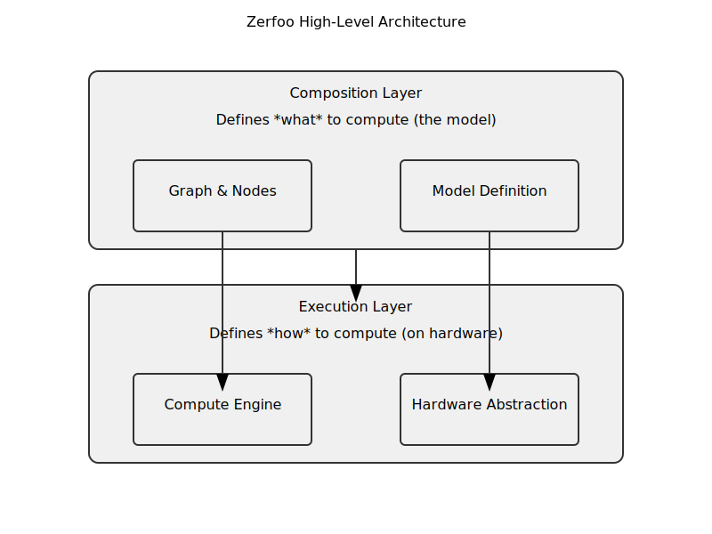

# Zerfoo: A High-Performance, Scalable, and Idiomatic Go Framework for Machine Learning

[](https://pkg.go.dev/github.com/zerfoo/zerfoo)
[](https://goreportcard.com/report/github.com/zerfoo/zerfoo)
[](https://opensource.org/licenses/Apache-2.0)

**Zerfoo** is a machine learning framework built from the ground up in Go. It is designed for performance, scalability, and developer experience, enabling everything from practical deep learning tasks to large-scale AGI experimentation.

By leveraging Go's strengths—simplicity, strong typing, and best-in-class concurrency—Zerfoo provides a robust and maintainable foundation for building production-ready ML systems.

> **Status**: Pre-release — actively in development.

---

## Quick Start

Define, train, and run a simple model in just a few lines of idiomatic Go.

```go
package main

import (
	"context"
	"fmt"

	"github.com/zerfoo/zerfoo/compute"
	"github.com/zerfoo/zerfoo/graph"
	"github.com/zerfoo/zerfoo/layers/activations"
	"github.com/zerfoo/zerfoo/layers/core"
	"github.com/zerfoo/zerfoo/numeric"
	"github.com/zerfoo/zerfoo/tensor"
	"github.com/zerfoo/zerfoo/training/optimizer"
	"github.com/zerfoo/zerfoo/types"
)

func main() {
	ctx := context.Background()
	ops := numeric.Float32Ops{}

	// 1. Create a compute engine
	engine := compute.NewCPUEngine(ops)

	// 2. Define the model architecture using a graph builder
	builder := graph.NewBuilder[float32](engine)
	input := builder.Input([]int{1, 10})
	
	dense1, _ := core.NewDense("dense1", engine, ops, 10, 32)
	node1 := builder.AddNode(dense1, input)
	
	act1 := activations.NewReLU[float32](engine, ops)
	node2 := builder.AddNode(act1, node1)
	
	dense2, _ := core.NewDense("dense2", engine, ops, 32, 1)
	output := builder.AddNode(dense2, node2)

	// 3. Build the computational graph
	g, err := builder.Build(output)
	if err != nil {
		panic(err)
	}

	// 4. Create an optimizer
	opt := optimizer.NewSGD[float32](engine, ops, 0.01)

	// 5. Generate dummy data
	inputTensor, _ := tensor.New[float32]([]int{1, 10}, nil)
	targetTensor, _ := tensor.New[float32]([]int{1, 1}, nil)

	// 6. Run the training loop
	for i := 0; i < 100; i++ {
		// Forward pass
		predTensor, _ := g.Forward(ctx, inputTensor)

		// Compute loss (dummy loss for this example)
		loss := predTensor.Data()[0] - targetTensor.Data()[0]
		gradTensor, _ := tensor.New[float32]([]int{1, 1}, []float32{2 * loss})

		// Backward pass to compute gradients
		g.Backward(ctx, types.FullBackprop, gradTensor)

		// Update weights
		opt.Step(ctx, g.Parameters())
	}

	fmt.Println("Training complete!")
}
```

## Why Zerfoo?

Zerfoo is designed to address the limitations of existing ML frameworks by embracing Go's philosophy.

*   ✅ **Idiomatic and Simple**: Build models using clean, readable Go. We favor composition over inheritance and explicit interfaces over magic.
*   🚀 **High-Performance by Design**: A static graph execution model, pluggable compute engines (CPU, GPU planned), and minimal Cgo overhead ensure your code runs fast.
*   ⛓️ **Robust and Type-Safe**: Leverage Go's strong type system to catch errors at compile time, not runtime. Shape mismatches and configuration issues are caught before training even begins.
*   🌐 **Scalable from the Start**: With first-class support for distributed training, Zerfoo is architected to scale from a single laptop to massive compute clusters.
*   🧩 **Modular and Extensible**: A clean, layered architecture allows you to extend any part of the framework—from custom layers to new hardware backends—by implementing well-defined interfaces.

## Core Features

-   **Declarative Graph Construction**: Define models programmatically with a `Builder` API or declaratively using Go structs and tags.
-   **Static Execution Graph**: The graph is built and validated once, resulting in error-free forward/backward passes and significant performance optimizations.
-   **Pluggable Compute Engines**: A hardware abstraction layer allows Zerfoo to target different backends. The default is a pure Go engine, with BLAS and GPU (CUDA) engines planned.
-   **Automatic Differentiation**: Gradients are computed efficiently using reverse-mode AD (backpropagation).
-   **First-Class Distributed Training**: A `DistributedStrategy` interface abstracts away the complexity of multi-node training, with support for patterns like All-Reduce and Parameter Server.
-   **Multi-Precision Support**: Native support for `float32` and `float64`, with `float16` and `float8` for cutting-edge, low-precision training.
-   **ONNX Interoperability**: Export models to the Open Neural Network Exchange (ONNX) format for deployment in any compatible environment.

## Extended Features

### Data Processing & Feature Engineering
-   **Data Package**: Comprehensive data loading with native Parquet support for efficient dataset handling
-   **Feature Transformers**: Built-in transformers for lagged features, rolling statistics, and FFT-based frequency domain features
-   **Normalization**: Automatic feature normalization (z-score) for stable training

### Advanced Model Components
-   **Hierarchical Recurrent Modules (HRM)**: Dual-timescale recurrent architecture with H-Module (high-level) and L-Module (low-level) for complex temporal reasoning
-   **Spectral Fingerprint Layers**: Advanced signal processing layers using Koopman operator theory and Fourier analysis for regime detection
-   **Feature-wise Linear Modulation (FiLM)**: Conditional normalization for dynamic model behavior adaptation
-   **Grouped-Query Attention (GQA)**: Memory-efficient attention mechanism with optional Rotary Positional Embeddings (RoPE)

### Enhanced Training Infrastructure
-   **Advanced Metrics**: Comprehensive evaluation metrics including Pearson/Spearman correlation, MSE, RMSE, and MAE
-   **Flexible Training Loops**: Generic trainer with pluggable loss functions, optimizers, and gradient strategies

## Architectural Vision

Zerfoo is built on a clean, layered architecture that separates concerns, ensuring the framework is both powerful and maintainable. A core tenet of this architecture is the use of the **Zerfoo Model Format (ZMF)** as the universal intermediate representation for models. This enables a strict decoupling from model converters like `zonnx`, ensuring that `zerfoo` focuses solely on efficient model execution without any ONNX-specific dependencies.



1.  **Composition Layer**: Define models as a Directed Acyclic Graph (DAG) of nodes (layers, activations). This layer is hardware-agnostic.
2.  **Execution Layer**: A pluggable `Engine` performs the actual tensor computations on specific hardware (CPU, GPU). This allows the same model to run on different devices without code changes.

For a deep dive into the design philosophy, core interfaces, and technical roadmap, please read our **[Architectural Design Document](docs/design.md)**.

## Advanced Usage Examples

### Advanced Training Techniques

Zerfoo supports advanced training techniques like batch normalization, dropout, and various optimizers to improve model performance and generalization.

```go
import (
    "github.com/zerfoo/zerfoo/layers/normalization"
    "github.com/zerfoo/zerfoo/layers/regularization"
    "github.com/zerfoo/zerfoo/training/optimizer"
)

// Add Layer Normalization
ln, _ := normalization.NewLayerNormalization(engine, hiddenDim)
nodeLN := builder.AddNode(ln, prevNode)

// Add Dropout for regularization
dropout := regularization.NewDropout(engine, ops, ops.FromFloat32(0.5)) // 50% dropout rate
nodeDropout := builder.AddNode(dropout, nodeLN)

// Use AdamW Optimizer with weight decay
opt := optimizer.NewAdamW[float32](engine, 0.001, 0.9, 0.999, 1e-8, 0.01)
```

### Model Evaluation

Evaluate your model after training using comprehensive metrics.

```go
import (
    "github.com/zerfoo/zerfoo/metrics"
)

// After training, run a validation pass
predTensor, _ := g.Forward(ctx, valInputTensor)

// Convert predictions and targets to float64 slices for evaluation
preds := convertToFloat64(predTensor.Data())
targets := convertToFloat64(valTargetTensor.Data())

// Calculate metrics
res := metrics.CalculateMetrics(preds, targets)
fmt.Printf("MSE: %.4f, Pearson: %.4f\n", res.MSE, res.PearsonCorrelation)

func convertToFloat64(data []float32) []float64 {
    out := make([]float64, len(data))
    for i, v := range data {
        out[i] = float64(v)
    }
    return out
}
```

### Creating Custom Layers

Zerfoo is designed to be extensible. You can easily create custom layers by implementing the `graph.Node[T]` interface.

```go
type CustomSquareNode[T tensor.Numeric] struct {
    engine      compute.Engine[T]
    outputShape []int
}

func (n *CustomSquareNode[T]) OpType() string { return "CustomSquare" }
func (n *CustomSquareNode[T]) Attributes() map[string]interface{} { return nil }
func (n *CustomSquareNode[T]) OutputShape() []int { return n.outputShape }

func (n *CustomSquareNode[T]) Forward(ctx context.Context, inputs ...*tensor.TensorNumeric[T]) (*tensor.TensorNumeric[T], error) {
    n.outputShape = inputs[0].Shape()
    return n.engine.Mul(ctx, inputs[0], inputs[0])
}

func (n *CustomSquareNode[T]) Backward(ctx context.Context, mode types.BackwardMode, outputGradient *tensor.TensorNumeric[T], inputs ...*tensor.TensorNumeric[T]) ([]*tensor.TensorNumeric[T], error) {
    // d/dx (x^2) = 2x
    two := n.engine.Ops().FromFloat64(2.0)
    twoX, _ := n.engine.MulScalar(ctx, inputs[0], two)
    grad, _ := n.engine.Mul(ctx, outputGradient, twoX)
    return []*tensor.TensorNumeric[T]{grad}, nil
}

func (n *CustomSquareNode[T]) Parameters() []*graph.Parameter[T] { return nil }
```

### Performance Benchmarking

Zerfoo includes built-in benchmarking tools to evaluate the performance of different engines and configurations.

To run the standard benchmarks:
```sh
go test ./compute -bench=. -benchmem
```

You can also use the `bench-compare` tool to compare performance across different commits or configurations:
```sh
go run cmd/bench-compare/main.go --baseline=benchmarks/baseline.txt --current=benchmarks/current.txt
```

## Contributing

Zerfoo is an ambitious project, and we welcome contributions from the community! Whether you're an expert in machine learning, compilers, or distributed systems, or a Go developer passionate about AI, there are many ways to get involved.

Please read our **[Architectural Design Document](docs/design.md)** to understand the project's vision and technical foundations.

## License

Zerfoo is licensed under the **Apache 2.0 License**.
